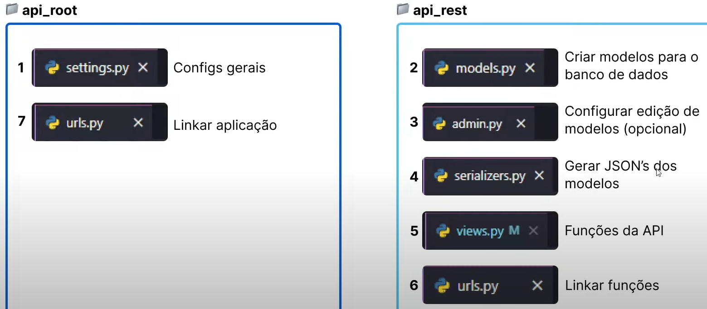

# Django_Learn
Repositório com a finalidade de estudar como realizar uma API com Django, utilizando python.

## API Python com Framework Django

### Estrutura do Django



### Instalação e configuração do Django API:
```bash
    pip install django djangorestframework django-cors-headers
```

**Criar arquivo de configuração do projeto:**
```bash
    django-admin startproject api_root .
```
- O ponto no final serve para criar o projeto no diretório atual (para não criar pastas dentro de pastas).

**Criar app do projeto:**
```bash
    py manage.py startapp api_rest
```
OU
```bash
    django-admin startapp api_rest
```

**Migração do banco de dados:**
```bash
    py manage.py migrate
```

OBS: Para os comandos, caso for linux digitar *python*, caso for windows digitar apenas *py*.

**Dicas úteis:**

Para salvar as versões de cada framework em um arquivo requirements.txt utilizar o comando abaixo:
```bash
    pip freeze > requirements.txt
```

Vídeo de apoio:
[Como criar uma API em Django - Criando um CRUD - Aula Completa](https://www.youtube.com/watch?v=Q2tEqNfgIXM)

### Criando e aplicando as migrations de banco de dados

Criando as migrations:
```bash
    py manage.py makemigrations
```

Aplicando as migrations:
```bash
    py manage.py migrate
```

Também pode ser feito os dois comandos de uma vez:
```bash
    py manage.py makemigrations && py manage.py migrate
```

### Criar super usuário (admin)

Para criar um admin, digite o comando abaixo:
```bash
    py manage.py createsuperuser
```

### Iniciar projeto:

```bash
    py manage.py runserver
```